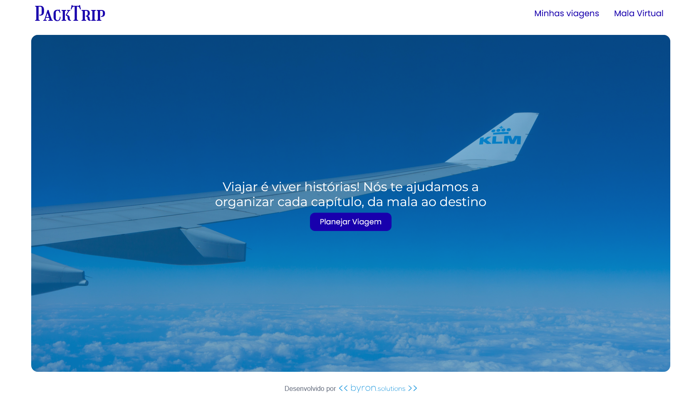

## Visão Geral

O projeto consiste no desenvolvimento de um site da marca fictícia **_PackTrip,_** feito como projeto final do trainee 2025.1

O site é focado no planejamento de viagens, com uma página dedicada ao gerenciamento e cadastro das viagens do cliente, e uma página ‘Mala Virtual’ que permite a organização da mala para diferentes ocasiões.

## Preview



## Tecnologias Utilizadas

O framework principal utilizado para desenvolvimento foi o Next.js

## Estrutura

### Página Minhas Viagens

Dedicada ao gerenciamento das viagens do cliente; Permite o cadastro, edição e exclusão de viagens contendo informações como destino, foto, categoria e período de duração. As viagens são exibidas em cards

### Página Mala Virtual

Dedicada ao gerenciamento da mala que será levada na viagem; É exibida uma lista de itens para a viagem, e o cliente pesquisa por itens pelo nome ou categoria. Permite o cadastro, edição e exclusão de itens.

## Como executar

Primeiro, rode o servidor de desenvolvimento:

```bash
npm run dev
# or
yarn dev
# or
pnpm dev
# or
bun dev
```

Abra [http://localhost:3000](http://localhost:3000) com seu navegador para ver o site
